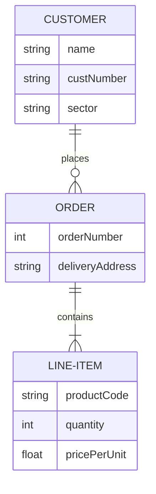

# SQL

Model


Find the top 10 voluable customers
```SQL

```


# algo

Give a range [a, b) and number n, write a function in any language you are comfortable  that returns how many numbers can be divided by number n in the range [a,b)


# reactjs

* How do your process state ?
* reactjs different from other framework? 
* pros and cons 


# javascript

* closure ?
* let vs var ?
* prototype vs object-oriented