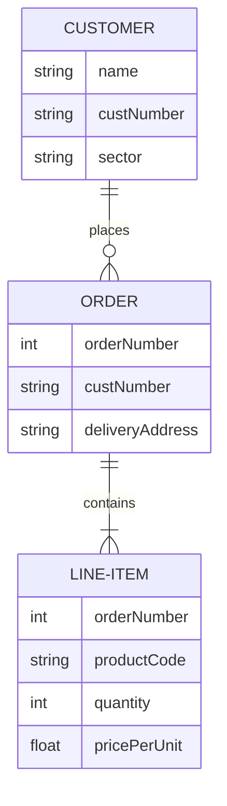

# SQL

Model


Find the top 10 voluable customers
```SQL
select 
from CUSTOMER
```


# language

* overriding vs overloading
* OOP principles
* functional programming languages  vs oop languages

# algo

* Give a range [a, b) and number n, write a function in any language you are comfortable that returns how many numbers can be divided by number n in the range [a,b)
* logical: leap year


# reactjs
  
* How do your process state ?
* reactjs different from other framework? 
* pros and cons 
* hook: 

# javascript

* closure ?
* let vs var ?
* prototype vs object-oriented


# flutter, dart 


# misc

* What was your big challenge in your current job? How do you handle that?
